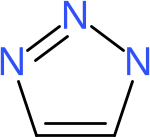

<a name="sec:ch:depiction"></a>
# Depiction

The CDK originates from the merger of Jmol and <a name="tp1">JChemPaint</a> [<a href="#citeref1">1</a>]. As such, CDK has long
contained code to depict molecules. However, after the 1.0 series, a rewrite of the code base
was initiated, causing the CDK 1.2 series to not be available with <a name="tp2">rendering</a> functionality.
During the development of the 1.4 series, the rendering code became gradually available as
a set of patches, and, separately, as a JChemPaint applet. The new rendering code has
entered the CDK.

However, if you need rendering of reaction schemes or the editing functionality found
in JChemPaint, you still need the <a name="tp3">CDK-JChemPaint</a> patch.

## Molecules

Rendering molecules to an image is done in a few steps. First, an `Image` needs
to be defined, for example, of 200 by 200 pixels. The next step is to define what is to be
generated, and how. The most basic rendering requires a few generators: one for the overall
scene, one for atoms, and one for bonds. Therefore, we add a [`BasicSceneGenerator`](http://cdk.github.io/cdk/latest/docs/api/org/openscience/cdk/renderer/generators/BasicSceneGenerator.html),
a [`BasicAtomGenerator`](http://cdk.github.io/cdk/latest/docs/api/org/openscience/cdk/renderer/generators/BasicAtomGenerator.html), and a [`BasicBondGenerator`](http://cdk.github.io/cdk/latest/docs/api/org/openscience/cdk/renderer/generators/BasicBondGenerator.html).
We will see later that we can add further generators to add further visualization.
Now that we defined what we want to have depicted, we construct a renderer. Because we
are rendering a molecule here, we simply use the [`AtomContainerRenderer`](http://cdk.github.io/cdk/latest/docs/api/org/openscience/cdk/renderer/AtomContainerRenderer.html).

<a name="fig:fig:triazole"></a>

<br />**Figure 16.1**: 2D diagram of triazole

We also need to define, however, what rendering platform we want to use. The Java
community has a few options, with the AWT/Swing platform to be the reference implementation
provided by Oracle, and the SWT toolkit as a popular second. In fact, the redesign
was needed to be able to support both widget toolkits. For rendering images,
we can use the AWT toolkit. Therefore, we use a [`AWTFontManager`](http://cdk.github.io/cdk/latest/docs/api/org/openscience/cdk/renderer/font/AWTFontManager.html) to help the
renderer draw texts. We get our `Graphics2D` object to which will be drawn from the
earlier created image, and we set some basic properties.
Then we are ready to draw the molecule to the graphics object with the `paint()`
method, and here again we need a AWT-specific class: the [`AWTDrawVisitor`](http://cdk.github.io/cdk/latest/docs/api/org/openscience/cdk/renderer/visitor/AWTDrawVisitor.html).

What then remains is to save the image to a <a name="tp4">PNG</a> image file with the
`ImageIO` helper class.

The full code example then looks like:

**Script** [code/RenderMolecule.groovy](code/RenderMolecule.code.md)
```groovy
new DepictionGenerator()
  .withSize(600, 600)
  .withMargin(0.1)
  .withZoom(3.0)
  .withAtomColors()
  .depict(triazole)
  .writeTo("RenderMolecule.png");
```

This results in the image of triazole given in Figure [16.1](#fig:fig:triazole).

## References

1. <a name="citeref1"></a>Krause S, Willighagen E, Steinbeck C. JChemPaint - Using the Collaborative Forces of the Internet to Develop a Free Editor for 2D Chemical Structures. Molecules. 2000 Jan 28;5(1):93–8.  doi:[10.3390/50100093](https://doi.org/10.3390/50100093) ([Scholia](https://scholia.toolforge.org/doi/10.3390/50100093))

