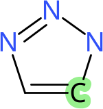

<a name="sec:ch:depiction"></a>
# Depiction

The CDK originates from the merger of Jmol and <a name="tp1">JChemPaint</a> [<a href="#citeref1">1</a>]. As such, CDK has long
contained code to depict molecules. However, after the 1.0 series, a rewrite of the code base
was initiated, causing the CDK 1.2 series to not be available with <a name="tp2">rendering</a> functionality.
During the development of the 1.4 series, the rendering code became gradually available as
a set of patches, and, separately, as a JChemPaint applet. The new rendering code has
entered the CDK.

However, if you need rendering of reaction schemes or the editing functionality found
in JChemPaint, you still need the <a name="tp3">CDK-JChemPaint</a> patch.

## Molecules

Rendering molecules to an image was previously done in a few steps. It involved 
a [`BasicSceneGenerator`](http://cdk.github.io/cdk/latest/docs/api/org/openscience/cdk/renderer/generators/BasicSceneGenerator.html), a [`BasicAtomGenerator`](http://cdk.github.io/cdk/latest/docs/api/org/openscience/cdk/renderer/generators/BasicAtomGenerator.html), and a
[`BasicBondGenerator`](http://cdk.github.io/cdk/latest/docs/api/org/openscience/cdk/renderer/generators/BasicBondGenerator.html).
Nowadays, we can use the convenience class `DepictionGenerator`.
The code example looks like this:

**Script** [code/RenderMolecule.groovy](code/RenderMolecule.code.md)
```groovy
new DepictionGenerator()
  .withSize(600, 600)
  .withMargin(0.1)
  .withZoom(3.0)
  .withAtomColors()
  .depict(triazole)
  .writeTo("RenderMolecule.png");
```

This results in the image of triazole given in Figure [16.1](#fig:fig:triazole).

<a name="fig:fig:triazole"></a>

<br />**Figure 16.1**: 2D diagram of triazole

## Background color

Starting from the above pattern, you can also customize the <a name="tp4">background color</a>.
This code uses the `withParam()` method to customize the rendering:

**Script** [code/BackgroundColor.groovy](code/BackgroundColor.code.md)
```groovy
new DepictionGenerator()
  .withSize(600, 600)
  .withMargin(0.1)
  .withZoom(3.0)
  .withAtomColors()
  .withParam(BasicSceneGenerator.BackgroundColor.class, Color.lightGray)
  .depict(triazole)
  .writeTo("BackgroundColor.png");
```

The result of this code is depicted in Figure [16.2](#fig:fig:backgroundColor).

<a name="fig:fig:backgroundColor"></a>

<br />**Figure 16.2**: Triazole depicted with a custom, grey background.

## Coloring selections

We can highlight atoms and bonds by giving them an annotation color. By default, it will color
the atoms with that color, but we may prefer to give them an outer glow. That means we need
to annotate the atoms, but also modify the generator parameter to select outer glow. The
width of the glow can also be tuned:

**Script** [code/RenderSelection.groovy](code/RenderSelection.code.md)
```groovy
triazole.getAtom(0).setProperty(
  StandardGenerator.HIGHLIGHT_COLOR, new Color(0x98F08E)
)
new DepictionGenerator()
  .withSize(600, 600)
  .withMargin(0.1)
  .withZoom(3.0)
  .withAtomColors()
  .withParam(StandardGenerator.Highlighting.class,
             StandardGenerator.HighlightStyle.OuterGlow)
  .withParam(StandardGenerator.OuterGlowWidth.class, 3d)
  .depict(triazole)
  .writeTo("RenderSelection.png");
```

This results in the image of triazole with an atom highlighted with a green background,
as given in Figure [16.3](#fig:fig:triazoleSelection).

<a name="fig:fig:triazoleSelection"></a>

<br />**Figure 16.3**: 2D diagram of triazole


## Parameters

Rendering wasn't as much fun, if you could not tune it to your needs. JChemPaint
has long had many rendering parameters, which are now all converting to the new
API. The following code is an modification of the code example in
snippet `RenderMolecule`, and adds some
code to list all rendering parameters for the three used generators:

**Script** [code/RendererParameters.groovy](code/RendererParameters.code.md)
```groovy
// generators make the image elements
List<IGenerator> generators =
  new ArrayList<IGenerator>();
font = new Font(Font.SANS_SERIF, Font.PLAIN, 13)
generators.add(new BasicSceneGenerator());
generators.add(new StandardGenerator(font));
// dump all parameters
for (generator in renderer.generators) {
  for (parameter in generator.parameters) {
    println "parameter: " +
      parameter.class.name.substring(40) +
      " -> " +
      parameter.value;
  }
}
```

The output will look something like:

```plain
parameter: BasicSceneGenerator$BackgroundColor -> java.awt.Color[r=255,g=255,b...
  =255]
parameter: BasicSceneGenerator$ForegroundColor -> java.awt.Color[r=0,g=0,b=0]
parameter: BasicSceneGenerator$Margin -> 10.0
parameter: BasicSceneGenerator$UseAntiAliasing -> true
parameter: BasicSceneGenerator$UsedFontStyle -> NORMAL
parameter: BasicSceneGenerator$FontName -> Arial
parameter: BasicSceneGenerator$ZoomFactor -> 1.0
parameter: BasicSceneGenerator$Scale -> 1.0
parameter: BasicSceneGenerator$BondLength -> 40.0
parameter: BasicSceneGenerator$FitToScreen -> false
parameter: BasicSceneGenerator$ShowMoleculeTitle -> false
parameter: BasicSceneGenerator$ShowTooltip -> false
parameter: BasicSceneGenerator$ArrowHeadWidth -> 10.0
parameter: BasicSceneGenerator$ShowReactionTitle -> false
parameter: standard.StandardGenerator$AtomColor -> org.openscience.cdk.rendere...
  r.color.UniColor@25dcf1b6
parameter: standard.StandardGenerator$Visibility -> org.openscience.cdk.render...
  er.generators.standard.SelectionVisibility@aa8dce8
parameter: standard.StandardGenerator$StrokeRatio -> 1.0
parameter: standard.StandardGenerator$BondSeparation -> 0.16
parameter: standard.StandardGenerator$WedgeRatio -> 6.0
parameter: standard.StandardGenerator$SymbolMarginRatio -> 2.0
parameter: standard.StandardGenerator$HashSpacing -> 5.0
parameter: standard.StandardGenerator$DashSection -> 8
parameter: standard.StandardGenerator$WaveSpacing -> 5.0
parameter: standard.StandardGenerator$FancyBoldWedges -> true
parameter: standard.StandardGenerator$FancyHashedWedges -> true
parameter: standard.StandardGenerator$Highlighting -> Colored
parameter: standard.StandardGenerator$OuterGlowWidth -> 2.0
parameter: standard.StandardGenerator$AnnotationColor -> java.awt.Color[r=255,...
  g=0,b=0]
parameter: standard.StandardGenerator$AnnotationDistance -> 0.25
parameter: standard.StandardGenerator$AnnotationFontScale -> 0.5
parameter: standard.StandardGenerator$SgroupBracketDepth -> 0.18
parameter: standard.StandardGenerator$SgroupFontScale -> 0.6
parameter: standard.StandardGenerator$OmitMajorIsotopes -> false
parameter: standard.StandardGenerator$ForceDelocalisedBondDisplay -> false
parameter: standard.StandardGenerator$DelocalisedDonutsBondDisplay -> true
parameter: standard.StandardGenerator$DeuteriumSymbol -> true
parameter: standard.StandardGenerator$PseudoFontStyle -> 3
```

## References

1. <a name="citeref1"></a>Krause S, Willighagen E, Steinbeck C. JChemPaint - Using the Collaborative Forces of the Internet to Develop a Free Editor for 2D Chemical Structures. Molecules. 2000 Jan 28;5(1):93–8.  doi:[10.3390/50100093](https://doi.org/10.3390/50100093) ([Scholia](https://scholia.toolforge.org/doi/10.3390/50100093))

