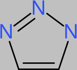

<a name="sec:ch:depiction"></a>
# Depiction

The CDK originates from the merger of Jmol and <a name="tp1">JChemPaint</a> [<a href="#citeref1">1</a>]. As such, CDK has long
contained code to depict molecules. However, after the 1.0 series, a rewrite of the code base
was initiated, causing the CDK 1.2 series to not be available with <a name="tp2">rendering</a> functionality.
During the development of the 1.4 series, the rendering code became gradually available as
a set of patches, and, separately, as a JChemPaint applet. The new rendering code has
entered the CDK.

However, if you need rendering of reaction schemes or the editing functionality found
in JChemPaint, you still need the <a name="tp3">CDK-JChemPaint</a> patch.

## Molecules

Rendering molecules to an image was previously done in a few steps. It involved 
a [`BasicSceneGenerator`](http://cdk.github.io/cdk/latest/docs/api/org/openscience/cdk/renderer/generators/BasicSceneGenerator.html), a [`BasicAtomGenerator`](http://cdk.github.io/cdk/latest/docs/api/org/openscience/cdk/renderer/generators/BasicAtomGenerator.html), and a
[`BasicBondGenerator`](http://cdk.github.io/cdk/latest/docs/api/org/openscience/cdk/renderer/generators/BasicBondGenerator.html).
Nowadays, we can use the convenience class `DepictionGenerator`.
The code example looks like this:

**Script** [code/RenderMolecule.groovy](code/RenderMolecule.code.md)
```groovy
new DepictionGenerator()
  .withSize(600, 600)
  .withMargin(0.1)
  .withZoom(3.0)
  .withAtomColors()
  .depict(triazole)
  .writeTo("RenderMolecule.png");
```

This results in the image of triazole given in Figure [16.1](#fig:fig:triazole).

<a name="fig:fig:triazole"></a>

<br />**Figure 16.1**: 2D diagram of triazole

## Background color

Starting from the above pattern, you can also customize the <a name="tp4">background color</a>.
This code uses the `withParam()` method to customize the rendering:

**Script** [code/BackgroundColor.groovy](code/BackgroundColor.code.md)
```groovy
new DepictionGenerator()
  .withSize(600, 600)
  .withMargin(0.1)
  .withZoom(3.0)
  .withAtomColors()
  .withParam(BasicSceneGenerator.BackgroundColor.class, Color.lightGray)
  .depict(triazole)
  .writeTo("BackgroundColor.png");
```

The result of this code is depicted in Figure [16.2](#fig:fig:backgroundColor).

<a name="fig:fig:backgroundColor"></a>

<br />**Figure 16.2**: Triazole depicted with a custom, grey background.

## References

1. <a name="citeref1"></a>Krause S, Willighagen E, Steinbeck C. JChemPaint - Using the Collaborative Forces of the Internet to Develop a Free Editor for 2D Chemical Structures. Molecules. 2000 Jan 28;5(1):93–8.  doi:[10.3390/50100093](https://doi.org/10.3390/50100093) ([Scholia](https://scholia.toolforge.org/doi/10.3390/50100093))

